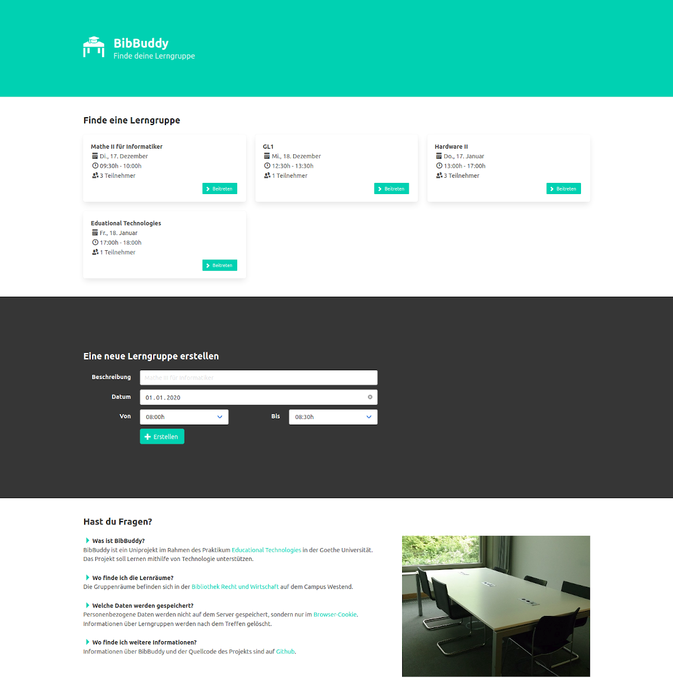

# BibBuddy

> A web application to match students who like to learn together for a particular class or subject.
> Students can appoint new study groups for a room, date and time. Other students may join this group.


<p align="center">
   
</p>

## Technologies

- Python with [Flask](https://github.com/pallets/flask/) for the backend
- [React](https://reactjs.org/) and [Bulma](https://bulma.io/) for the frontend

## Setup

Install [Docker](https://docs.docker.com/install/) and run:

```sh
docker-compose up
```

After that, the server is available under [localhost:5000](http://localhost:5000).

## More information

This is a project as part of the ["Educational Technology" seminar](https://www.edutec.guru/teaching/).
